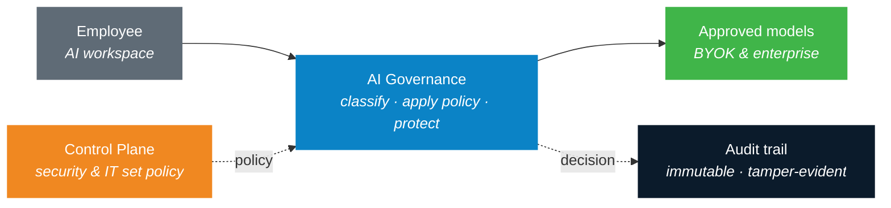

<!--
  ThreatLens — public overview README (thethreatlens-inc/-public-resources-).
  Keep README.md and banner.png together in the same folder so the banner resolves.
-->

 

**Govern every AI request — classify, protect, route, and record — before any model sees your data.**

  
  
  
  

  <a href="https://thethreatlens.com"><b>Website</b></a> &nbsp;·&nbsp;
  <a href="https://docs.thethreatlens.com"><b>Documentation</b></a> &nbsp;·&nbsp;
  <a href="https://thethreatlens.com/demo"><b>Request a demo</b></a>

---

## The problem

Your people are already using AI, and the productivity gains are real — but every prompt is a potential data-loss event. Customer data, payment information, source code, and board strategy can end up in a public model with **no control and no record**. Banning AI drives it underground; allowing it freely exposes the business.

**ThreatLens is the third option: govern it.**

## How it works

Every AI request — from the workspace or through the gateway API — passes through a single governance layer before any model sees it.

The request is **classified** by content, your **policy** decides what may happen, sensitive data is **protected**, the request is **routed** only to a destination you trust — and every **decision is recorded** to an immutable audit trail.

## The platform

|  |  |
|---|---|
| **AI Workspace** | A familiar chat experience where employees use approved models, grounded in your own company knowledge. |
| **AI Governance** | The engine in the middle of every request — classify, apply policy, protect sensitive data — showing the decision *before* the answer appears. |
| **Control Plane** | Where security, compliance, and IT set the rules, connect their own models, manage identity, and review the audit trail. |

## Capabilities

| Capability | What it does |
|---|---|
| **Content classification** | 10 data classes (PCI, PII, secrets, source code, financial, legal, HR, strategy, customer) via deterministic + semantic detection. |
| **Policy matrix** | Set, per data class, the minimum trust tier, the action, and internet access. One grid, owned by security. |
| **Trust-tiered routing (BYOK)** | Keep confidential work on your own approved models — Azure OpenAI, AWS Bedrock — never a public one. |
| **Data loss protection** | Inline redaction of sensitive spans, inbound and outbound; raw secrets and prompt-injection always blocked. |
| **Governed retrieval** | Answers grounded in your Microsoft 365 content, access-trimmed per user, fail-closed. |
| **Immutable audit trail** | Every decision recorded, hash-chained and tamper-evident; streamable to your SIEM. |
| **Monitor or enforce** | Observe-only first to measure exposure, then switch enforcement on with confidence. |
| **Identity & access** | RBAC (21 permissions), SSO / SAML (Entra, Okta, Google), group→role mapping. |

## Enterprise-ready

- **Deploy anywhere** — managed SaaS, your private cloud, or fully self-hosted.
- **Bring your own models & keys** — Azure OpenAI, AWS Bedrock.
- **Fail-closed by design** — when in doubt, protect.
- **Content-safe logging** — hashes and redacted excerpts, never raw sensitive payloads.
- **Single front door** — the backend stays private behind one rate-limited ingress.

## Who it's for

Security and platform teams adopting AI across the enterprise — **CISOs**, **security operations**, **platform / IT**, and **compliance & risk**.

## Resources

| | |
|---|---|
| Website | https://thethreatlens.com |
| Documentation | https://docs.thethreatlens.com |
| Request a demo | https://thethreatlens.com/demo |

---

<b>ThreatLens</b> — The Intelligence Layer for Enterprises &nbsp;·&nbsp; © 2026 ThreatLens, Inc.

